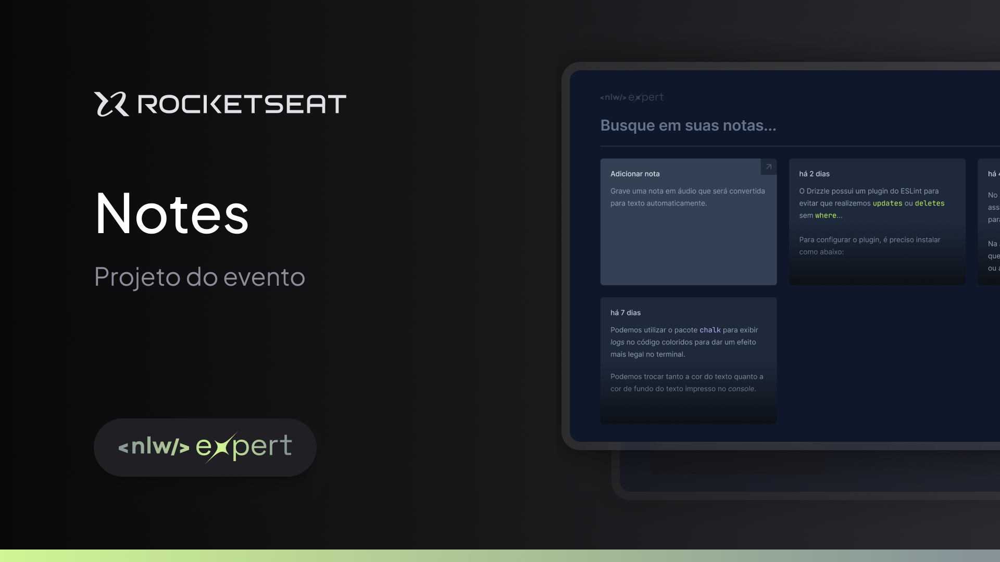

<h1 align="center">
  <br>Notes 📓<br/>
  ReactJS | Vite | TypeScript
  <br/>
  <br/>
  
  <br/>
  <a href="https://wakatime.com/badge/user/920a7e43-2969-4212-82ff-1b375685ff58/project/018c0764-81db-45ee-a69b-15c8549c3972">
    
  </a>
</h1>

<p align="center">
  <a href="#bookmark-about-the-project">About</a>&nbsp;&nbsp;&nbsp;|&nbsp;&nbsp;&nbsp;
  <a href="#rocket-technologies">Technologies</a>&nbsp;&nbsp;&nbsp;|&nbsp;&nbsp;&nbsp;
  <a href="#boom-how-to-execute">How to Execute?</a>&nbsp;&nbsp;&nbsp;|&nbsp;&nbsp;&nbsp;
  <a href="#memo-license">License</a>
</p>

## :bookmark: About the Project

The **Notes** is an application for those who wish to write notes. With it you can write, see, modify and delete notes.

This app was developed on **ReactJS track** during the **NLW Expert**, the project by [Rocketseat](https://www.rocketseat.com.br/).

## :rocket: Technologies

- [Date-fns](https://date-fns.org/)
- [Eslint](https://eslint.org/)
- [Husky](https://typicode.github.io/husky/)
- [Lucida React](https://lucide.dev/guide/packages/lucide-react)
- [NanoId](https://zelark.github.io/nano-id-cc/)
- [NPM](https://www.npmjs.com/)
- [Radix UI](https://www.radix-ui.com/)
- [ReactJS](https://reactjs.org/)
- [Sonner](https://sonner.emilkowal.ski/)
- [TailwindCSS](https://tailwindcss.com/)
- [TypeScript](https://www.typescriptlang.org/)
- [Vite](https://vitejs.dev/)

## :boom: How to Execute?

- ### **Prerequisite**

  - You must have **[Git](https://git-scm.com/)** installed and configured in your computer.
  - Also, it's **needs** to have a package manager as **[Yarn](https://yarnpkg.com/)**, **[NPM](https://www.npmjs.com/)** or others.
  - Finally, it's **necessaries** to have [Node.js](https://nodejs.org/en) greater or equal version `20.11.x`.

```bash
npm install # for install dependencies
npm run dev # for execute application
```

## :memo: License

This project is sob MIT License. See on file [LICENSE](./LICENSE) for more details.

---

<sup>The project developed with tutoring of [Diego Fernandes](https://github.com/diego3g) from [Rocketseat](https://www.rocketseat.com.br/).</sup>
